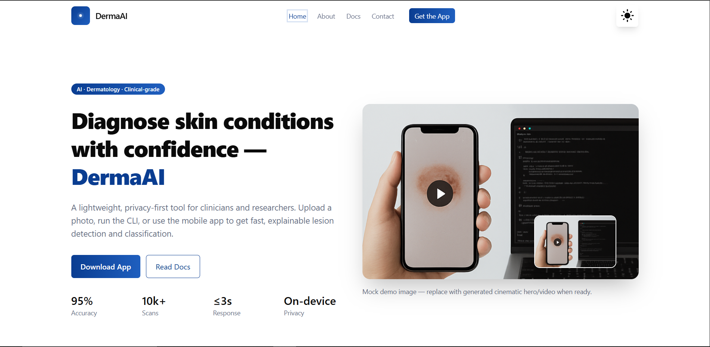
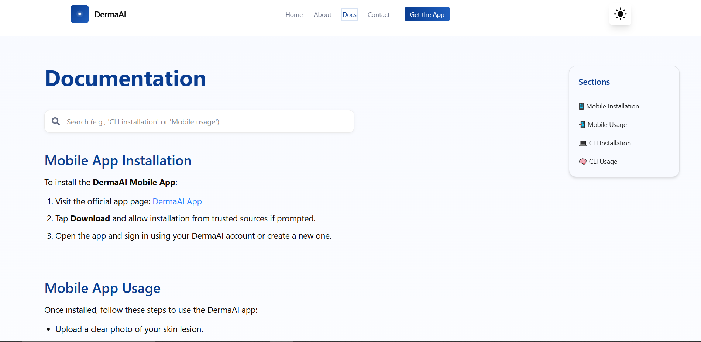
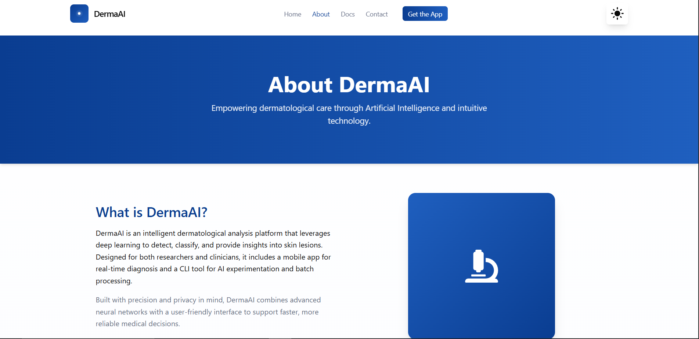
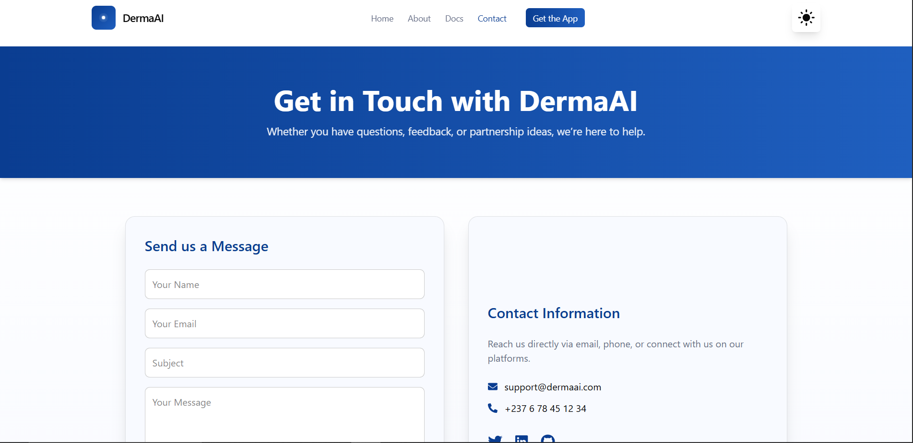

# 🩺 DermaWeb — Skin Lesion Detection Web Interface

DermaWeb is a responsive, modern React-based web application designed to provide a **user-friendly interface** for the **DermAI model** — an AI-powered system for skin lesion detection and classification.
It offers a simple, intuitive experience for users, researchers, and clinicians to **upload images**, **view predictions**, and **learn about the model**.

---

## 📁 Project Structure

```
src/
 ┣ assets/               # images, icons, logos, etc.
 ┣ components/           # reusable UI components (Navbar, Footer, etc.)
 ┣ layouts/              # shared layouts (e.g., MainLayout.jsx)
 ┣ pages/                # route pages (Home, About, Docs, Contact)
 ┣ data/                 # static info (nav links, feature data, etc.)
 ┣ App.jsx               # main routes
 ┣ main.jsx              # React root
 ┗ index.css             # global styles
```

---

## 🧭 Table of Contents

1. [Overview](#overview)
2. [Key Features](#key-features)
3. [Tech Stack](#tech-stack)
4. [Installation & Setup](#installation--setup)
5. [Available Scripts](#available-scripts)
6. [Project Architecture](#project-architecture)
7. [Screenshots](#screenshots)
8. [API Integration (Optional)](#api-integration-optional)
9. [Design Decisions](#design-decisions)
10. [Contributing](#contributing)
11. [License](#license)
12. [Acknowledgements](#acknowledgements)

---

## 🧩 Overview

DermaWeb acts as the **front-end layer** for the DermAI system, providing:

* A **clean and responsive interface** for end-users.
* A **documentation section** for researchers and contributors.
* **Integration-ready routes** for AI model APIs (upload, inference, results, etc.).

It serves both educational and operational purposes — to demonstrate how medical AI models can be deployed with real-world usability.

---

## ✨ Key Features

* 🖼️ **Upload and Predict:** Interface for uploading skin lesion images.
* 📚 **Documentation Page:** Explains how the model works, usage steps, and FAQs.
* 🔄 **Dynamic Routing:** Multi-page React router setup.
* 📱 **Responsive Design:** Fully functional on desktop and mobile.
* 🧠 **Model Integration Ready:** Easily connect with Flask/FastAPI endpoints.
* 💡 **Fixed Right Sidebar Navigation:** Quick access to main pages for easy browsing.

---

## 🛠️ Tech Stack

| Category            | Tools / Libraries                  |
| ------------------- | ---------------------------------- |
| **Frontend**        | React (Vite)                       |
| **Styling**         | Tailwind CSS                       |
| **Icons**           | React Icons                        |
| **Routing**         | React Router DOM                   |
| **Version Control** | Git + GitHub                       |

---

## ⚙️ Installation & Setup

### 1. Clone the Repository

```bash
git clone https://github.com/NganeEmmanuel/DermaWeb.git
cd DermaWeb
```

### 2. Install Dependencies

```bash
npm install
```

### 3. Run Development Server

```bash
npm run dev
```

Open your browser and navigate to `http://localhost:5173` (or as shown in terminal).

### 4. Build for Production

```bash
npm run build
```

---

## 🧱 Available Scripts

| Command           | Description                         |
| ----------------- | ----------------------------------- |
| `npm run dev`     | Runs the app in development mode    |
| `npm run build`   | Builds the app for production       |
| `npm run preview` | Serves the production build locally |
| `npm run lint`    | Runs lint checks                    |

---

## 🧩 Project Architecture

```
DermaWeb/
 ┣ src/
 ┃ ┣ assets/              # Images, icons, etc.
 ┃ ┣ components/          # Reusable UI parts (Navbar, Footer, Sidebar)
 ┃ ┣ layouts/             # Page layout wrappers
 ┃ ┣ pages/               # Each route page (Home.jsx, Docs.jsx, etc.)
 ┃ ┣ data/                # Static config (nav links, constants)
 ┃ ┣ App.jsx              # Defines routes
 ┃ ┣ main.jsx             # React DOM root entry
 ┗ ┗ index.css            # Global styles
```

---

## 📸 Screenshots

> 📍 Replace the placeholders below with actual screenshots (in `/assets/screenshots/`).

| Section                      | Screenshot                                        |
| ---------------------------- | ------------------------------------------------- |
| **Home Page**                |      |
| **Documentation Page**       |      |
| **Upload / Prediction Page** |  |
| **Responsive View (Mobile)** |  |

> 💡 You can also embed animated GIFs or YouTube demo links here.


## 🧠 Design Decisions

* **Right Sidebar Navigation:** To maintain persistent, quick access to pages without scrolling.
* **Modular Components:** Navbar, Footer, Sidebar, and Cards are isolated for reusability.
* **Data-Driven Navigation:** Links and sections managed from `/src/data/navLinks.js`.
* **Scalable Layouts:** Layout files in `/layouts` make it easy to create multi-page designs.

---

## 🤝 Contributing

Contributions are welcome!
Please follow these steps:

1. Fork the repository
2. Create a feature branch (`git checkout -b feature/new-feature`)
3. Commit changes (`git commit -m "Add new feature"`)
4. Push to branch (`git push origin feature/new-feature`)
5. Create a Pull Request

---

## 📜 License

This project is licensed under the **MIT License**.
See the [LICENSE](LICENSE) file for more details.

---

## 🙏 Acknowledgements

* **DermAI Project** — for the underlying AI model.
* **React & TailwindCSS** — for the frontend ecosystem.
* **OpenAI / ChatGPT** — for documentation assistance.

---

## 📹 Demo (Optional)

[](https://youtube.com/watch?v=your-demo-id)
